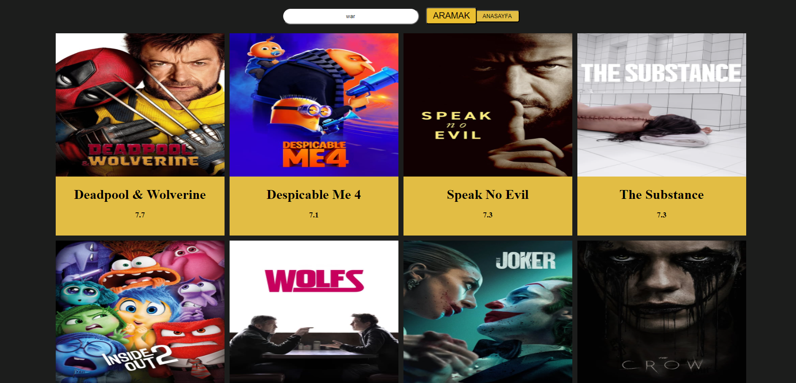
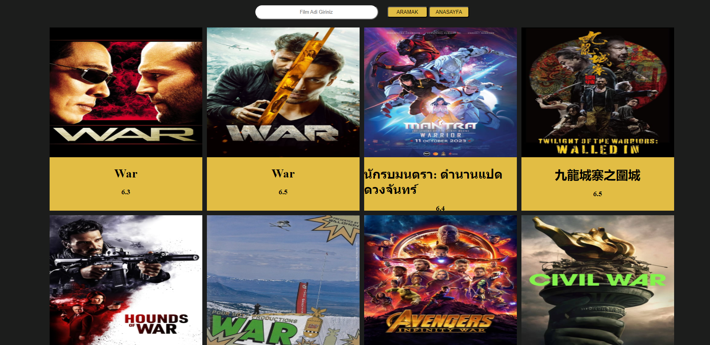

# Film API Uygulaması

Bu proje, film verilerini görüntülemek ve arama yapmak için kullanılan bir web uygulamasıdır. Kullanıcılar, film adı girerek arama yapabilir ve popüler filmleri görüntüleyebilir.

## Özellikler

- Kullanıcı dostu arayüz
- Film arama özelliği
- Popüler filmleri görüntüleme
- Film bilgilerini dinamik olarak gösterme

## Teknolojiler

- **HTML**: Uygulamanın yapısını oluşturmak için kullanıldı.
- **CSS**: Uygulamanın stilini ve görünümünü düzenlemek için kullanıldı.
- **JavaScript**: Kullanıcı etkileşimini ve dinamik içerik güncellemelerini sağlamak için kullanıldı.
- **API**: [The Movie Database (TMDb)](https://www.themoviedb.org/) API'si kullanılarak film verileri alındı. Bu sayede uygulama, güncel film bilgilerini dinamik olarak elde etmektedir.

